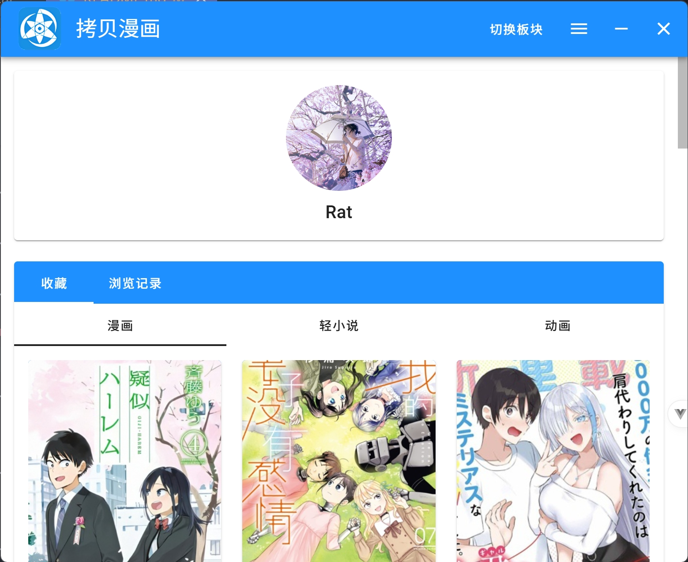
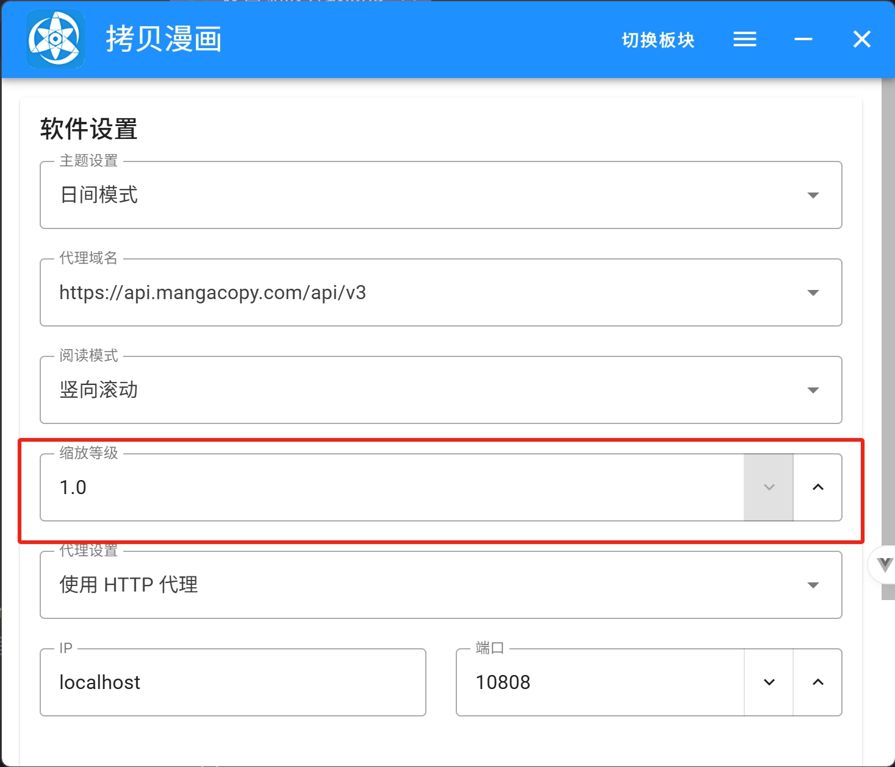

# copy-desktop

这是一个拷贝漫画的第三方客户端，基于 electron + vue 构建。

## NSFW 警告⚠

本软件可能存在裸露、暴力、色情或冒犯等不适宜公众场合的内容，请勿在公共场合使用本软件，避免不必要的纷争。

## 功能

- [x] 登录
- [x] 日夜间模式
- [x] 简易用户信息
- [x] 自动登录
- [x] 历史记录
- [x] 漫画模块
  - [x] 搜索
  - [x] 阅读
  - [x] 收藏
  - [x] 详情
  - [x] 分类
  - [x] 下载
  - [x] 发表评论
  - [x] 查看评论
  - [x] 首页推荐
  - [x] 目录阅读
- [x] 轻小说模块
  - [x] 阅读
  - [x] 搜索
  - [x] 详情
  - [x] 收藏
  - [x] 分类
  - [x] 下载
  - [x] 发表评论
  - [x] 查看评论
- [x] 动漫模块
  - [x] 推荐
  - [x] 搜索
  - [x] 详情
  - [x] 收藏
  - [x] 分类
  - [x] 观看
  - [x] 下载
  - [x] 发表评论
  - [x] 查看评论

## 截图

### 漫画

#### 首页

#### 个人中心

#### 详情（日间模式）

#### 详情（夜间模式）

#### 阅读（翻页模式）

#### 阅读（滚动模式）

#### 搜索

## 声明

本软件仅用于教育、学习和研究目的，旨在帮助开发者和用户理解应用程序的工作原理。作者与原始应用程序的开发者、公司或组织无关。所有涉及的代码或技术分析均为个人研究成果，并未用于商业用途或恶意活动。请勿将本软件用于任何违反法律或侵犯原开发者权利的活动。作者不对他人使用本软件产生的任何法律或财务后果承担责任。请在 24 小时内删除本软件。

## 安装包

目前还在开发阶段，请自行构建。

~~只提供 win 、 linux 的 x86 绿色包，所有数据只在解压的目录中，整体文件夹可随意拷贝移动（下载路径除外）。mac 用户请使用源码自行构建。~~

## 问题

### 读取网址设置失败

TIPS：虽然使用的为拷贝国内的 api ，但依然推荐使用代理进行浏览，速度会快很多。

请在设置中启用代理，这里填写的为默认的 V2rayN 的代理地址，如下图所示：

并将选择的 api 添加到你的代理规则中，V2rayN 默认的 v3 路由规则已可以代理 api.copy2000.online 该域名，手动添加如下图：

### 高分辨率下字体过小

windows 百分百缩放设置下，请在设置中更改缩放等级，建议 2k 屏幕设置为 1.4 ， 4k 屏幕为 1.8 ，如下图

### 没有写真模块

这个不做

---

如果你喜欢该软件，动动小手点个 star 就是对我最大的鼓励和帮助🙇‍！